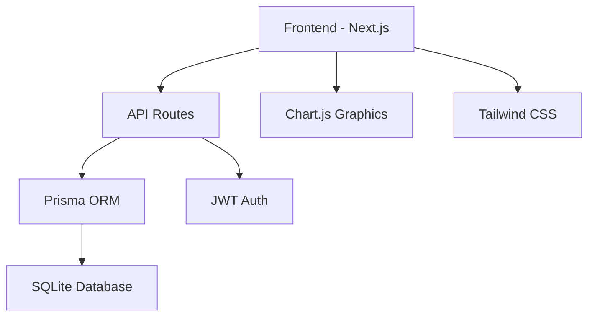

# Social Media Dashboards

Painel de métricas sociais personalizadas desenvolvido com **Next.js**, **TypeScript** e **Tailwind CSS**. Permite que usuários registrem e visualizem métricas como visualizações, curtidas e compartilhamentos em diferentes plataformas sociais, com gráficos interativos baseados em dados manuais.


## ✅ Funcionalidades Implementadas

### 🔐 Autenticação
* Sistema de **login seguro com JWT** (JSON Web Token)
* Verificação de senha com `bcryptjs`
* Armazenamento de token em **cookie HTTP-only**
* Cookies configurados com segurança (`secure` e `httpOnly`)

> ❗ **Cadastro de usuário ainda não implementado.**

### 📈 Registro de Métricas
* O usuário pode adicionar métricas como:
   * Nome da plataforma (ex: Instagram, YouTube)
   * Visualizações
   * Curtidas
   * Compartilhamentos
   * Data da métrica
* As métricas são armazenadas com **Prisma ORM** em um banco de dados **SQLite**

### 📊 Dashboard Interativo
* Gráficos dinâmicos com:
   * **Chart.js** via `react-chartjs-2`
   * **Filtro por plataforma e por data**
* Visualização clara da evolução das métricas cadastradas manualmente

## ⚙️ Tecnologias Utilizadas

| Categoria | Tecnologias |
|-----------|-------------|
| **Frontend** | Next.js, TypeScript |
| **Estilização** | Tailwind CSS |
| **Backend/API** | Next.js API Routes, Axios |
| **Banco de Dados** | SQLite + Prisma ORM |
| **Segurança** | JWT, bcryptjs, cookies |
| **Gráficos** | Chart.js, react-chartjs-2 |
| **Utilitários** | date-fns, react-datepicker |

## 📁 Estrutura do Projeto

```
Social-Media-Dashboards/
├── prisma/
│   └── schema.prisma          # Esquema e migrações do banco
├── src/
│   ├── lib/                   # Utilitários (auth, prisma client)
│   ├── pages/                 # Páginas e rotas da API
│   │   └── api/               # API Routes do Next.js
│   └── components/            # Componentes reutilizáveis
├── public/                    # Imagens e favicon
├── .env.local                 # Variáveis de ambiente (não versionado)
├── README.md
└── package.json
```

## 🚀 Como rodar localmente

### Pré-requisitos
- Node.js (versão 18 ou superior)
- npm ou yarn

### Instalação

```bash
# 1. Clone o repositório
git clone https://github.com/wendel211/Social-Media-Dashboards.git
cd Social-Media-Dashboards

# 2. Instale as dependências
npm install

# 3. Configure as variáveis de ambiente
cp .env.example .env.local
# Edite o arquivo .env.local com suas configurações

# 4. Configure o banco de dados
npx prisma migrate dev --name init

# 5. Execute o projeto em modo de desenvolvimento
npm run dev
```

Acesse [http://localhost:3000](http://localhost:3000) para ver a aplicação rodando.

## 🔧 Scripts Disponíveis

```bash
npm run dev          # Executa em modo de desenvolvimento
npm run build        # Cria build de produção
npm run start        # Executa build de produção
npm run lint         # Executa o linter
npx prisma studio    # Abre interface visual do banco de dados
```

## 📌 Status Atual das Funcionalidades

| Recurso | Status |
|---------|--------|
| Cadastro de usuário | ❌ Não implementado |
| Integração com API do Twitter | ❌ Não implementado |
| Sincronização automática de dados | ❌ Somente manual |
| Testes automatizados | ❌ Ausentes |
| Middleware de proteção de rotas | ⚠️ Parcial (verificação no backend, não no front) |

## 🚧 Roadmap Futuro

### Próximas implementações:
- [ ] **Tela e rota de cadastro de usuário**
- [ ] **Integração com a API do Twitter** para importar métricas reais
- [ ] **Gravação automática de métricas externas** no banco de dados
- [ ] **Melhorias na UI/UX** com animações e responsividade
- [ ] **Implementação de testes** unitários e de integração
- [ ] **Suporte a múltiplas redes sociais** (Instagram, TikTok, etc.)
- [ ] **Dashboard em tempo real** com WebSockets
- [ ] **Exportação de relatórios** em PDF/Excel
- [ ] **Sistema de notificações** para metas e alertas

## 🔐 Variáveis de Ambiente

Crie um arquivo `.env.local` na raiz do projeto:

```env
# Database
DATABASE_URL="file:./dev.db"

# JWT Secret
JWT_SECRET="seu-jwt-secret-aqui"

# Next.js
NEXTAUTH_URL=http://localhost:3000
NEXTAUTH_SECRET="seu-nextauth-secret"

# APIs (para futuras integrações)
TWITTER_API_KEY="sua-twitter-api-key"
TWITTER_API_SECRET="sua-twitter-api-secret"
```

## 📊 Exemplo de Uso da API

### Registrar nova métrica:
```javascript
// POST /api/metrics
{
  "platform": "Instagram",
  "views": 1200,
  "likes": 85,
  "shares": 12,
  "date": "2025-06-28"
}
```

### Buscar métricas:
```javascript
// GET /api/metrics?platform=Instagram&startDate=2025-06-01&endDate=2025-06-30
```

## 🤝 Contribuindo

Contribuições são sempre bem-vindas! Para contribuir:

1. Fork o projeto
2. Crie uma branch para sua feature (`git checkout -b feature/nova-funcionalidade`)
3. Commit suas mudanças (`git commit -m 'Adiciona nova funcionalidade'`)
4. Push para a branch (`git push origin feature/nova-funcionalidade`)
5. Abra um Pull Request

### Diretrizes:
- Siga o padrão de código existente
- Adicione testes para novas funcionalidades
- Documente mudanças significativas
- Use mensagens de commit descritivas

## 🐛 Relatando Bugs

Encontrou um bug? [Abra uma issue](https://github.com/wendel211/Social-Media-Dashboards/issues) com:
- Descrição detalhada do problema
- Passos para reproduzir
- Screenshots (se aplicável)
- Informações do ambiente (OS, navegador, etc.)

## 📝 Changelog

### v1.0.0 (Atual)
- ✅ Sistema de autenticação com JWT
- ✅ Registro manual de métricas
- ✅ Dashboard com gráficos interativos
- ✅ Filtros por plataforma e data
- ✅ Interface responsiva com Tailwind CSS

## 🏗️ Arquitetura



## 📄 Licença

Este projeto está sob a licença **MIT**. Veja o arquivo [LICENSE](LICENSE) para mais detalhes.

## 🙏 Agradecimentos

- [Next.js](https://nextjs.org/) - Framework React
- [Prisma](https://www.prisma.io/) - ORM moderno
- [Chart.js](https://www.chartjs.org/) - Biblioteca de gráficos
- [Tailwind CSS](https://tailwindcss.com/) - Framework CSS

---

<div align="center">
  <p>Desenvolvido com ❤️ por <a href="https://github.com/wendel211">wendel211</a></p>
  <p>⭐ Se este projeto te ajudou, considere dar uma estrela!</p>
</div>


---

> 💡 **Dica**: Para uma experiência completa, considere integrar com APIs reais das redes sociais para automatizar a coleta de métricas!
